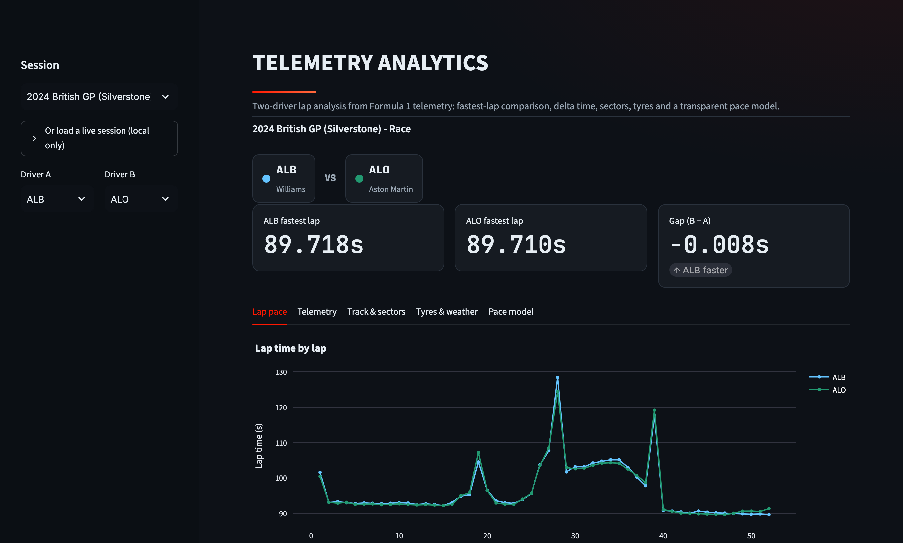
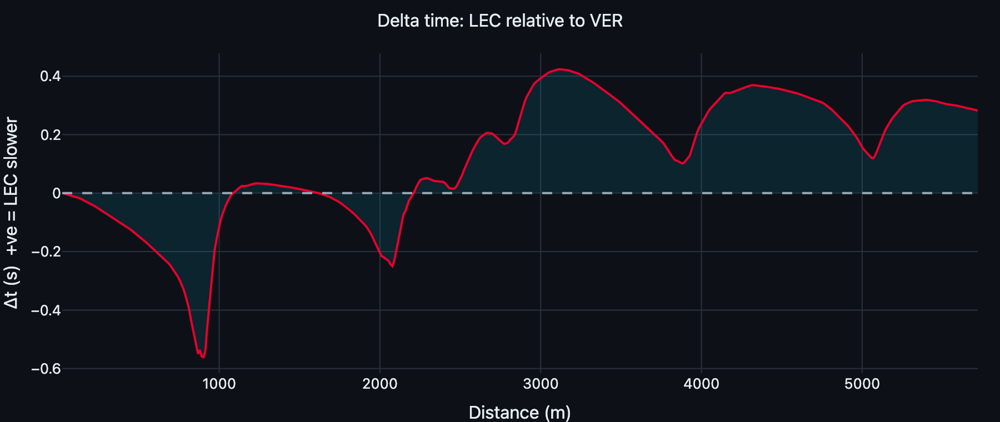
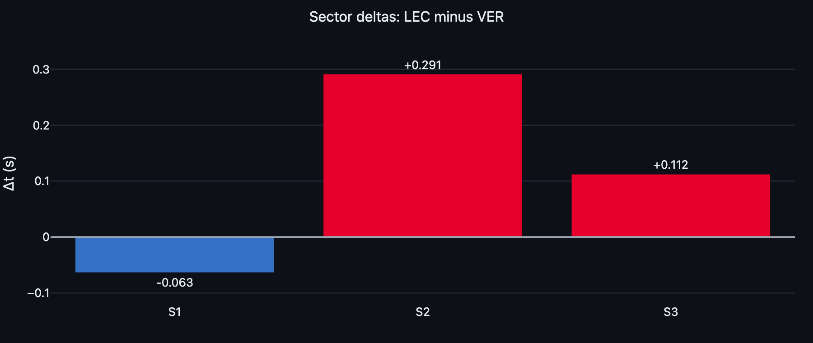
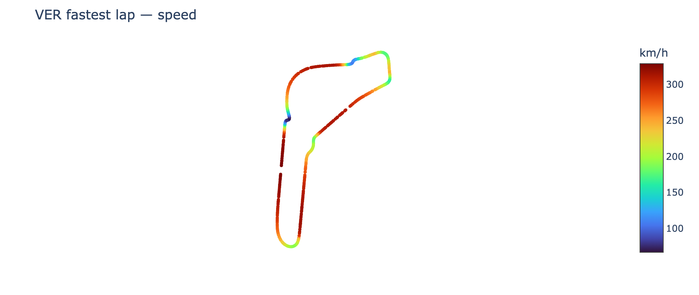

# Motorsport Telemetry Analytics

An interactive dashboard for analyzing Formula 1 telemetry and race performance. Pick a session
and two drivers, then compare their fastest laps: speed/throttle/brake/gear traces, delta time,
sector deltas, a track-position map, tyre strategy, weather, and a transparent tyre-degradation
and lap-time model. Built on public data via [FastF1](https://github.com/theOehrly/Fast-F1).

**Live demo:** https://motorsport-telemetry-analytics.vercel.app



*Two-driver comparison with real F1 team colours, delta time, sector splits, and a pace model.*

> The hosted demo is a static web app (`web/`) over five bundled example sessions: the 2024
> Silverstone and Suzuka races, the 2023 Monza and Bahrain races, and 2023 Monaco qualifying.
> Run the Streamlit app locally to load any live session from 2018 onward.

## Why this exists
Take real time-series sensor data, turn it into analysis that explains *where* and *why* one
driver is faster, and present it so an engineer can make a decision. The techniques (aligning
telemetry on a common axis, filtering representative laps, estimating degradation) transfer
directly to any vehicle-telemetry or sensor problem.

## Features
- **Session picker:** choose a bundled example session (or a live session when running locally),
  then two drivers.
- **Lap comparison:** lap time by lap number; fastest-lap gap.
- **Telemetry overlay:** delta time and speed, throttle, brake, and gear traces for both drivers'
  fastest laps, on a shared distance axis.
- **Track & sectors:** X/Y track map coloured by speed; per-sector time deltas.
- **Tyres & weather:** per-driver stint/compound/tyre-age summary; session weather.
- **Model tab:** tyre-degradation estimate and a lap-time model against a naive baseline, with
  methodology and limitations shown in-app.

## Screenshots
| Delta time | Sector deltas | Track map (speed) |
|---|---|---|
|  |  |  |

## Architecture
```
app.py                       Streamlit UI: session/driver pickers, tabs, wiring
src/
  data_loader.py             FastF1 session loading + unified accessors (live or sample)
  sample_data.py             load bundled offline sample sessions (parquet)
  preprocessing.py           clean laps, filter green/representative laps, stint summary
  telemetry_analysis.py      delta time, channel overlays, sector deltas (pure pandas)
  modeling.py                tyre degradation + lap-time model vs baseline
  visualizations.py          Plotly figure builders (also used to export assets)
tests/                       network-free unit tests (preprocessing, modeling, sample data)
scripts/build_sample_data.py export the bundled offline sessions from FastF1
scripts/export_web_data.py   export session JSON for the static web dashboard
scripts/generate_assets.py   re-generate README charts + verified results
web/                         static web dashboard (Vite + TypeScript + Plotly.js)
data/sample/                 bundled offline example sessions (~1 MB, parquet)
results/                     verified metrics (model_metrics.json, tyre_degradation.csv)
```
Analysis is kept separate from plotting and from the UI, so every number is unit-tested and the
same figures power both the app and this README.

## Technologies
Python · FastF1 · pandas · NumPy · scikit-learn · Plotly · Streamlit · pytest
(kaleido is used only to export the static chart images.)

## Setup
```bash
git clone https://github.com/Johaan-Mannanal/motorsport-telemetry-analytics
cd motorsport-telemetry-analytics
python -m venv .venv && source .venv/bin/activate
pip install -r requirements.txt
cp .env.example .env          # optional; sets the FastF1 cache dir

streamlit run app.py          # launch the dashboard
pytest -q                     # run tests (no network needed)
```
The bundled example sessions load instantly. If you enable a **live** session (in the sidebar),
FastF1 downloads and caches it locally on first use (a few seconds), then reads from the cache.

## Data source
Public F1 timing and telemetry via **FastF1** (official live-timing + Ergast/Jolpica archive),
covering 2018–present. See [`data/README.md`](data/README.md). Unofficial; not affiliated with
Formula 1.

## Modeling approach
A deliberately **transparent** data-science component, not a strategy oracle:
1. **Tyre degradation**: per compound, fit lap time vs. tyre age on green laps; the slope is
   "seconds lost per lap of tyre life."
2. **Lap-time model**: linear regression on tyre age, lap number (a fuel-burn proxy), one-hot
   compound, and one-hot driver, compared against a **baseline** that predicts the mean lap time.
   Evaluated on **whole held-out driver stints** (GroupShuffleSplit, 25%, seed 42) so laps from
   the same stint never appear in both training and testing; reporting MAE and RMSE.

## Verified results
Reproduce with `python scripts/generate_assets.py` (writes [`results/model_metrics.json`](results/model_metrics.json)).
Reference session: **2023 Italian Grand Prix (Monza), Race**, 878 green laps
(628 train / 250 test, split by whole driver stints).

| Model | MAE (s) | RMSE (s) |
|-------|---------|----------|
| Baseline (predict mean lap time) | 0.733 | 0.901 |
| **Lap-time model** (linear regression) | **0.396** | **0.553** |

On laps from entirely unseen stints, the model cuts the baseline error by **46%**. Tyre degradation at Monza (a
low-degradation circuit) came out to ~**0.025 s per lap of tyre life** for both HARD and MEDIUM,
with **low R² (0.04–0.07)**, which is honest: at Monza, tyre age alone explains little of the
lap-to-lap variation (fuel, traffic, and driver pace dominate). Higher-degradation circuits show
steeper, cleaner slopes.

## Limitations
- **Single-session** models; coefficients are correlational, not causal.
- The lap-time model includes **driver identity**, so it partly memorizes per-driver pace: it is
  **not** a generalizable cross-race predictor.
- Green-lap filtering is a heuristic; weather, track evolution, and fuel mass are only crudely
  proxied. The held-out set is grouped by driver stint, so within-stint correlation cannot leak
  between train and test.
- This is an analysis tool, **not** a replacement for a race engineer's judgment.

## Deploy
The hosted demo is the static dashboard in `web/` (Vite + TypeScript + Plotly.js), deployed on
Vercel with the project root set to `web/`. It consumes JSON pre-exported by
`scripts/export_web_data.py`, so it needs no Python backend and loads instantly. The Streamlit
app (`app.py`) is for local use, where FastF1 can fetch any live session.

## Future plans
- Add more bundled example sessions and one more analysis view (e.g., driver-consistency).
- Optional: evaluate the lap-time model **across** races with driver identity removed, to test
  genuine generalization.

## License
MIT, see [LICENSE](LICENSE). FastF1 and F1 data belong to their respective owners.
